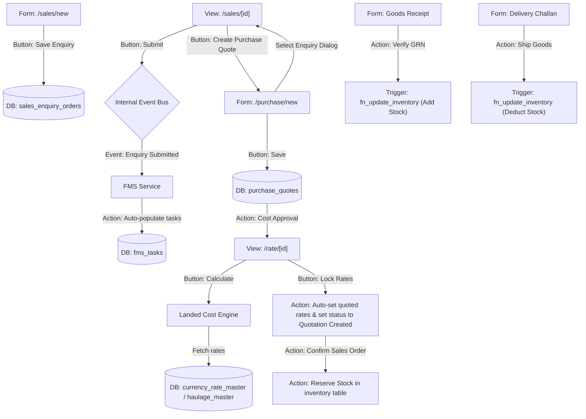

# KOI-ERP Module-by-Module Operational & Button Connectivity Manual

This manual provides a highly detailed walkthrough of the user interface (UI) screens, individual buttons, background processes, API requests, and database schema triggers within the **KOI-ERP System (KOI-ERPP)**.

---

## 1. Sales & CRM Module

This module governs customer relations, logs client inquiries, maps product requirements, and kicks off the pricing calculations.

### 1.1 Sales Enquiry Dashboard Page (`/dashboard/sales`)
- **Purpose**: Displays a search-enabled table of all customer enquiries.
- **Key UI Elements & Filters**:
  - **Search Input**: Triggers a wildcard lookup against `enquiry_order_no`, `buyer_name`, and `buyer_code`.
  - **Status Filter Tabs**: Filters list by `draft`, `submitted`, `punched`, `verified`, `won`, or `lost`.
- **Primary Buttons & Interactions**:
  - **"Create New Enquiry" Button**: 
    - *Action*: Navigates the browser to `/dashboard/sales/new`.
  - **Row Click**: 
    - *Action*: Opens the enquiry detail page (`/dashboard/sales/[id]`).

### 1.2 Create Sales Enquiry Form (`/dashboard/sales/new`)
- **Purpose**: Standardizes input for new customer requests.
- **Form Fields (Validated with Zod)**:
  - `buyerName` (Required string)
  - `buyerCode` (Select dropdown connected to `customers` master)
  - `poNumber` / `poDate` (Optional strings/dates)
  - `portOfLoading` / `portOfDischarge` (Required location selectors)
- **Primary Buttons & Interactions**:
  - **"Add Product Row" Button**:
    - *Action*: Appends an empty object to the items array. Renders dropdown selectors to map SKUs from the `products` table.
  - **"Save Enquiry" Button**:
    - *Action*: Validates fields. Fires `POST /api/v1/sales-enquiries` with the fields payload.
    - *Connectivity*: Calls SQL function `fn_get_next_enquiry_number()`, inserts rows in `sales_enquiry_orders` and `sales_enquiry_order_items`, and sets status to `draft`. Redirects to `/dashboard/sales`.

### 1.3 Sales Enquiry Detail Page (`/dashboard/sales/[id]`)
- **Purpose**: Acts as the dashboard hub for a single enquiry. Displays the progress bar, customer details, logistics terms, line items, and audit history.
- **Primary Buttons & Interactions**:
  - **"Refresh" Button**:
    - *Action*: Re-triggersTanStack Query `useQuery` query keys `['enquiry', id]` to fetch fresh state.
  - **"Submit Enquiry" Button** *(Visible only when Status = `draft`)*:
    - *Action*: Prompts remarks modal. Fires `PATCH /api/v1/sales-enquiries/:id/status` setting status to `submitted`.
    - *Connectivity*: Triggers Event Bus listener `fms-event.listener.ts`, automatically creating a design & labeling checklist inside `fms_tasks`.
  - **"Punch" Button** *(Visible only when Status = `submitted`)*:
    - *Action*: Transitions status to `punched`. Confirms item lines are ready for pricing audits.
  - **"Verify" Button** *(Visible only when Status = `punched`)*:
    - *Action*: Transitions status to `verified`.
  - **"Send to Purchase" Button** *(Visible only when Status = `verified`)*:
    - *Action*: Sets status to `purchase_pending`.
    - *Connectivity*: Automatically alerts the purchase manager to compile supplier quotes.
  - **"Send to Rate" Button** *(Visible only when Status = `verified` / `purchase_pending`)*:
    - *Action*: Sets status to `rate_pending`.
    - *Connectivity*: Prompts pricing calculations in the **Rate Analysis** module.
  - **"Create Purchase Quote" (Quick Action) Button**:
    - *Action*: Navigates to `/dashboard/purchase/new?enquiry={id}`.
    - *Connectivity*: Pulls items, quantity, brand, and target rates from the Enquiry to pre-populate the RFQ form.
  - **"Start Rate Analysis" (Quick Action) Button**:
    - *Action*: Navigates to `/dashboard/rate?enquiry={id}`.
    - *Connectivity*: Automatically builds a landed cost worksheet using the current enquiry items.
  - **"Request Approval" Button** *(Visible only when Status = `rate_pending`)*:
    - *Action*: Transitions status to `approval_pending`. Starts approval processes in the Workflow engine.
  - **"Create Quotation" Button** *(Visible only when Status = `approval_pending`)*:
    - *Action*: Generates client-facing PDF quote sheets and shifts status to `quotation_created`.
  - **"Mark Sent" Button**:
    - *Action*: Switches status to `quotation_sent` once the document is emailed.
  - **"Mark Won" Button** / **"Mark Lost" Button**:
    - *Action*: Closes the Sales Enquiry. If won, triggers the **"Convert to Sales Order"** routine, updating stock allocations.

---

## 2. Purchase & Procurement Module

This module manages supplier quote sheets, freight landed costs, and purchase orders.

### 2.1 Purchase Dashboard Page (`/dashboard/purchase`)
- **Purpose**: Displays the listing of RFQs (`purchase_quotes`) and vendor quote statuses.
- **Primary Buttons & Interactions**:
  - **"New Quote Request" Button**:
    - *Action*: Navigates to `/dashboard/purchase/new`.
  - **Row Click**:
    - *Action*: Opens `/dashboard/purchase/[id]`.

### 2.2 Purchase Quote Detail Page (`/dashboard/purchase/[id]`)
- **Purpose**: Displays vendor pricing sheets, country/port logistics, and purchase lines. Features toggleable editing inputs.
- **Primary Buttons & Interactions**:
  - **"Edit" Button** *(Visible when Status = `draft`)*:
    - *Action*: Activates client state `isEditing = true`. Transforms static text fields (Party Code, Country, City, payment methods) and pricing table cells into inputs.
  - **"Cancel" Button**:
    - *Action*: Reverts input states to default and cancels editing.
  - **"Save Changes" Button**:
    - *Action*: Validates inputs and fires `PATCH /api/v1/purchase/quotes/:id`.
    - *Connectivity*: Recalculates values (Buying Price * (1 + GST) + Freight) and updates `purchase_quote_items`.
  - **"Submit Quote" Button**:
    - *Action*: Transitions status from `draft` to `submitted`. Lock entries from editing.
  - **"Approve Costing" Button** *(Visible when Status = `submitted` for managers)*:
    - *Action*: Fires `POST /api/v1/purchase/quotes/:id/approve`.
    - *Connectivity*: Marks rates as approved, changing the status to `approved`, allowing the values to be used in the Rate Analysis module.
  - **"Print Quote" Button**:
    - *Action*: Triggers browser print styles to export the vendor details sheet.
  - **"Select Enquiry..." Search Dialog Button**:
    - *Action*: Opens a dialog searching `sales_enquiry_orders`.
    - *Connectivity*: On selection, fetches items and metadata, replacing the current quote form values.
  - **"Select Vendor..." Search Dialog Button**:
    - *Action*: Queries `vendors` master. Maps selected vendor details onto the form.
  - **"Add Row" Button**:
    - *Action*: Appends a blank item structure.
  - **"Product Search" Button** *(magnifying glass icon)*:
    - *Action*: Queries `products` master. Maps chosen product variables (SKU, brand, MRP, standard buying cost) to the row.
  - **"Delete Row" Button** *(trashcan icon)*:
    - *Action*: Filters out the selected line item.

---

## 3. Rate Analysis Module

Calculates local landed costs, converts currencies, and models selling prices.

### 3.1 Rate Analysis Detail Page (`/dashboard/rate/[id]`)
- **Purpose**: Serves as the master pricing sheet interface.
- **Primary Buttons & Interactions**:
  - **"Calculate" Button**:
    - *Action*: Fires `POST /api/v1/rate/analysis/:id/calculate`.
    - *Connectivity*: The backend calculates landed values using active exchange rates, HSN rates, and haulage per CBM. Re-renders the calculation grid.
  - **"Submit for Approval" Button**:
    - *Action*: Submits pricing matrix values to administrators. Status shifts to `approval_pending`.
  - **"Approve" Button** / **"Reject" Button** *(Managers/Admins)*:
    - *Action*: Sets workflow outcome. If approved, status changes to `approved`.
  - **"Lock Rates" Button** *(Visible only when Status = `approved`)*:
    - *Action*: Sets status to `locked`.
    - *Connectivity*: Locks pricing values. Triggers status update on the linked Sales Enquiry to `quotation_created` and populates `quoted_rate` values.
  - **"Requote" Button**:
    - *Action*: Unlocks calculations and creates a new document version sequence for revisions.
  - **"Export" Button**:
    - *Action*: Opens options to download the sheet as an Excel file or PDF document.
  - **"Version History" Button**:
    - *Action*: Opens a slide-out drawer displaying past analysis pricing drafts.
  - **Summary Cards (Purchase Value, Selling Value, Margin, USD Rate, Haulage)**:
    - *Action*: Admins can click on these cards to change variables instantly.
    - *Connectivity*: Saves changes via `PATCH /api/v1/rate/analysis/:id` and alerts the user to recalculate.

---

## 4. Inventory Module

Tracks stock movements, multi-warehouse transfers, and adjustments.

### 4.1 Stock View Page (`/dashboard/inventory/stock`)
- **Key UI Elements**: Displays inventory counts by product, warehouse location, and batch.
- **Primary Buttons & Interactions**:
  - **"Adjust Stock" Button**:
    - *Action*: Navigates to `/dashboard/inventory/stock/adjust`.
    - *Connectivity*: Submits adjustments (`POST /api/v1/inventory/adjust`) updating counts and logging historical lines in `inventory_transactions`.
  - **"Transfer Stock" Button**:
    - *Action*: Opens transfer panel mapping source/destination warehouses.

---

## 5. FMS Task Tracking Module

Manages design workflows, pre-production tasks, and notifications.

### 5.1 FMS Kanban Page (`/dashboard/fms/tasks`)
- **Key UI Elements**: Column columns mapping task states (`pending`, `in_progress`, `completed`, `delayed`).
- **Primary Buttons & Interactions**:
  - **Task Card Drag-and-Drop**:
    - *Action*: Triggers status update request to `/api/v1/fms/tasks/:id/status`.
  - **"Complete Task" Button**:
    - *Action*: Fires complete mutation. Updates checklist item completion timestamps.

---

## 6. Multi-Module Connectivity Pipeline

The following schema maps how user actions trigger cascades across different modules:

---
*Created on 2026-06-13. Essential operational guide for system deployments.*
