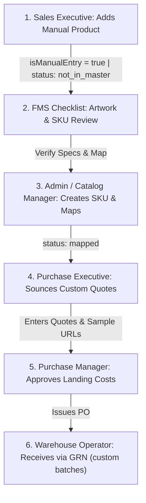

# Manual Product ("Not In Master") Workflow & Handoff Guide

In **KOI-ERP**, a product designated as **"NOT IN MASTER"** (or manual entry) represents a custom, private-label, or pre-production item requested by a customer that does not yet exist in the company's official master product catalog (`products` table). 

This guide describes how this custom workflow operates step-by-step across different user roles, from initial customer enquiry to final catalog mapping and warehouse receiving.

---

## 1. Role-Wise Workflow Breakdown

Below is the chronological journey of a custom item, detailing what each role does and what screens they use.

---

### Step 1: Sales Executive (Initiation)
* **Goal**: Log the customer's custom product request.
* **Screen**: **Sales ➔ Enquiries ➔ New** (or edit draft enquiry).
* **Action**:
  1. Under the line items grid, clicks **"Add Product Row"**.
  2. Because the requested item (e.g. *"Custom Logo 250g Coffee Bag"*) does not exist in the dropdown catalog, the executive checks the **"Manual Entry"** checkbox.
  3. Fills in the following custom fields:
     * **Manual Product Name**: `Custom Logo 250g Coffee Bag`
     * **Product Description**: `Foil lined, zipper bag with custom front labels`
     * **Brand / Category / Unit Size / Qty / Target expected rate**
  4. Clicks **"Save Enquiry"** and then clicks **"Submit Enquiry"** (`nextStatus = submitted`).
* **Database Updates**: 
  - `isManualEntry` is set to `true`.
  - `masterStatus` is set to `'not_in_master'`.
  - Linked `product_id` is set to `NULL`.

---

### Step 2: FMS Specialist / Designer (Specs Checklist)
* **Goal**: Review packaging requirements, artwork drawings, and sizing metrics.
* **Screen**: **FMS ➔ Tasks Kanban**.
* **Action**:
  1. An automated FMS task is generated: *"Review Custom Artwork for ENQ-XXXX"*.
  2. The designer checks the customer's uploaded label designs (linked in Sales documents).
  3. Audits carton details, volumes, and carton CBM parameters.
  4. Uploads approved PDF layouts to **Sales Documents** and updates the task status to **Completed**.

---

### Step 3: Admin / Catalog Manager (Catalog Mapping)
* **Goal**: Bind the manual entry to an official catalog SKU so it can be ordered.
* **Screen**: **Masters ➔ Products ➔ New** and **Sales ➔ Enquiries ➔ [id]**.
* **Action**:
  1. Evaluates the custom product details verified by the FMS team.
  2. Navigates to **Masters ➔ Products** and creates a formal catalog SKU (`POST /api/v1/masters/products`), logging its HSN, standard buying price, and dimensions.
  3. Returns to the Sales Enquiry details, edits the manual row, sets `masterStatus` to `'mapped'`, and links the newly generated `product_id`.
* **Database Updates**:
  - `masterStatus` transitions to `'mapped'`.
  - `product_id` is updated from `NULL` to the new record UUID.

---

### Step 4: Purchase Executive (RFQ Sourcing)
* **Goal**: Gather price quotes from packaging suppliers.
* **Screen**: **Purchase ➔ Quotes ➔ New**.
* **Action**:
  1. Selects the Sales Enquiry order. The system pulls the mapped item detail.
  2. Sours quotes from vendors. Under product details, inputs the vendor's quoted unit rate, custom print plates charges, freight, and links sample images in the **Image Link** field.
  3. Clicks **"Submit Quote"**.

---

### Step 5: Purchase Manager (Approval & Ordering)
* **Goal**: Approve custom costing and issue PO.
* **Screen**: **Purchase ➔ Quotes ➔ [id]** and **Purchase Orders ➔ New**.
* **Action**:
  1. Compares supplier pricing and plate costs.
  2. Clicks **"Approve Costing"**.
  3. Converts the quote into a **Purchase Order** (`PO-XXXX`), authorizing production.

---

### Step 6: Warehouse Operator (Inward Receipt)
* **Goal**: Receive the custom shipment and trace batches.
* **Screen**: **Inventory ➔ Goods Receipt Notes (GRN) ➔ New**.
* **Action**:
  1. Inspects custom packaging labels upon arrival.
  2. Enters received quantities.
  3. **Critical Step**: Since this is a custom private-label item, the operator *must* input a custom manufacturer **Batch Number** and **Expiry Date** to separate this batch from other standard products.
  4. Clicks **"Verify GRN"**.
* **Database Updates**:
  - Increments stock in `inventory` table specifically mapped to the custom batch and warehouse location.

## 2. Database & API Method References

When custom items are created, they follow a programmatic lifecycle in the NestJS API. Here is the technical breakdown of the tables and backend service operations:

### 2.1 Database Attributes Map
Custom items are tracked in the database via the following columns:

| Table | Column | Type | Description |
| :--- | :--- | :--- | :--- |
| `sales_enquiry_order_items` | `is_manual_entry` | `BOOLEAN` | Set to `true` if typed manually without a predefined product SKU. |
| `sales_enquiry_order_items` | `master_status` | `VARCHAR(50)` | Current validation phase: `'not_in_master'`, `'pending_review'`, or `'mapped'`. |
| `sales_enquiry_order_items` | `product_id` | `UUID` | Linked `products.product_id` (NULL until mapped by catalog manager). |
| `sales_enquiry_order_items` | `manual_product_name`| `VARCHAR(255)`| User-typed name string. |
| `sales_enquiry_order_items` | `manual_description` | `TEXT` | User-typed description specifications. |
| `products` | `source` | `VARCHAR(50)` | Set to `'manual'` for custom items to distinguish from standard catalog items. |
| `products` | `product_status` | `VARCHAR(50)` | Lifecycle state: `'pending_review'`, `'pending_mis_review'`, `'active'`, or `'inactive'`. |
| `products` | `temp_product_name` | `VARCHAR(255)`| Back-up of the original user-inputted manual name. |

### 2.2 Core Backend API Methods (`masters.service.ts`)
The system uses three key functions in the backend to manage custom items:

1. **`createManualProduct(manualProductName, enquiryId, enquiryNo, userId, remarks)`**:
   * *Trigger*: Called automatically inside `sales.service.ts` when an enquiry is saved with `isManualEntry: true`.
   * *Behavior*: Creates a temporary product in the `products` table, generates a placeholder SKU (prefixed with `TEMP-` and a timestamp), sets `isActive` to `false`, and flags the status as `PENDING_REVIEW` (`pending_review`).
2. **`reviewProduct(productId, dto, userId)`**:
   * *Trigger*: Invoked when the Catalog Manager reviews custom specifications.
   * *Behavior*:
     * *Map to Existing*: Links the line to an existing catalog SKU and flags the temporary product as `isActive = false`.
     * *Submit to MIS*: Saves updated custom specifications (unit size, carton CBM, buying price) and shifts status to `PENDING_MIS_REVIEW` (`pending_mis_review`).
3. **`misReviewProduct(productId, dto, userId)`**:
   * *Trigger*: Invoked when the MIS Manager performs final reviews.
   * *Behavior*:
     * *Approval*: Generates a final SKU from the `number_series` generator (mapping category/segment codes), marks status as `ACTIVE` (`active`), `source` as `MASTER`, sets `isActive` to `true`, and calls `enrichEnquiryItemsWithMasterProduct` to automatically map all associated Sales lines.
     * *Rejection*: Marks status as `INACTIVE`.

---

## 3. Visual Prompt: System Architecture & Connectivity Blueprint

Copy and paste the prompt below into AI image generators (such as Midjourney, DALL-E 3, or Stable Diffusion) to produce a high-fidelity visual blueprint of the KOI-ERP systems connectivity:

> **Technical Image Generation Prompt**:
> A technical blueprint and connectivity schematic of a cloud-native enterprise ERP software system, dynamic infographic design, poster layout. Dark blue and chalkboard background, neon circuit lines in electric blue, bright cyan, orange, and purple, linking servers, databases, and microservices. The layout displays distinct node compartments: 1. "CLIENT DEV PORTAL": Visualizing a Next.js web application with dashboard grid lines, API requests, and web socket notification signals. 2. "API GATEWAY": Illustrated as a central hub router distributing traffic with laser paths. 3. "MICRO-SERVICE MODULES": Node sections representing Sales Sourcing, Purchase Comparison, Costing Grid, FMS Kanban task cards, and Workflow Engine. 4. "DATABASE CONTROLLER": A database server icon labeled "PostgreSQL Multi-Tenant RLS" showing row isolation screens. 5. "CACHING & QUEUES": Labeled "Redis / BullMQ" with processing ring circles. Everything is connected with glowing schematic arrows, flow diagrams, clean sans-serif callout text labels, and UI/UX design annotations. Technical chart aesthetics, futuristic blueprint poster, clean lines, maximum complexity, high-resolution vector schematic, 8k rendering. --ar 16:9
