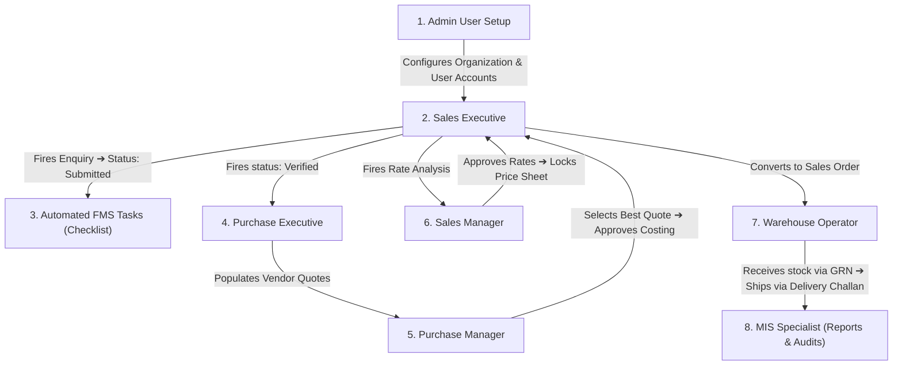

# KOI-ERP: Role-Wise Operational Flows & UI Image Generation Prompts

This guide outlines:
1. **Role-Wise System Flows**: The exact duties, accessed screens, and task handoffs for each of the 7 system roles in the ERP.
2. **UI Mockup Image Generation Prompts**: Highly detailed, descriptive prompts matching the actual layouts and styling of the Next.js frontend, ready to be used in AI image generators (DALL-E, Midjourney, Stable Diffusion) to produce realistic app mockups.

---

## PART 1: Role-Wise System Flows & Access Maps

Below is the operational journey of each user type, outlining which screens they see, the buttons they click, and how they interact with other roles.

---

### 1.1 System Administrator (Admin)
* **Access Level**: Full global database read/write access.
* **Responsibilities**: Organization setup, billing, currency updates, user-role mapping, and audit logging.
* **Operational Flow**:
  1. Logs in and accesses **Dashboard ➔ Admin Settings**.
  2. Sets up organizational defaults in the `companies` table.
  3. Registers employees, assigns email accounts, and maps them to system roles (e.g. mapping user accounts to `SALES_EXECUTIVE` or `PURCHASE_MANAGER`).
  4. Configures default serial number formats in `number_series` (e.g. prefixing sales enquiries with `ENQ` and purchase quotes with `PUR`).
  5. Enters default base exchange rates (`INR`, `USD`, `GBP`, `EUR`) in the currency master.
  6. Monitors security logs under **Audit Trails** to review system actions and modifications.

### 1.2 Sales Executive
* **Access Level**: Writes sales enquiries, customer details, and coordinates final client delivery notes.
* **Operational Flow**:
  1. Accesses **Dashboard ➔ Masters ➔ Customers** to view or register new buyers.
  2. Accesses **Sales ➔ Enquiries ➔ New** to create a client query. Fills in buyer code, country, port configurations, container size, and target price lines.
  3. Clicks **"Save Enquiry"** (inserts row in `sales_enquiry_orders`, status = `draft`).
  4. Reviews products, verifies details, and clicks **"Submit Enquiry"** (status = `submitted`). This action triggers automated checklist tasks for designers.
  5. Once the procurement team logs quotes, clicks **"Start Rate Analysis"** to calculate landed values and margins.
  6. Clicks **"Request Approval"** (status = `approval_pending`).
  7. Once approved by the manager, clicks **"Create Quotation"** to generate the PDF contract, and updates the status to `quotation_sent`.
  8. If won, clicks **"Mark Won"** which auto-creates a Sales Order (`sales_orders`) and sends shipping files to the warehouse.

### 1.3 Sales Manager
* **Access Level**: Approves enquiries, reviews pipelines, and sets pricing margins.
* **Operational Flow**:
  1. Accesses **Sales ➔ Enquiries** and filters by `submitted` or `punched`.
  2. Audits sales representative entries, verifies target rates, and clicks **"Verify"** to advance the status to `verified`.
  3. Reviews sales pipelines via the Kanban task board to check for delays.
  4. Audits customer pricing folders, evaluates gross profitability margins, and clicks **"Approve Rates"** to authorize quotations.
  5. Accesses **Sales ➔ Invoices** to review billing records before they are sent to the client.

### 1.4 Purchase Executive (Procurement Officer)
* **Access Level**: Manages RFQs, monitors supplier quote forms, and maps logistics rates.
* **Operational Flow**:
  1. Accesses the **Dashboard** and checks notifications for new requests labeled `purchase_pending`.
  2. Accesses **Purchase ➔ Quotes ➔ New** (or clicks **"Create Purchase Quote"** from the Sales Enquiry screen).
  3. Clicks **"Select Enquiry"** to import line items, quantities, and target pricing from the sales file.
  4. Selects a supplier using the **"Select Vendor"** modal.
  5. Inputs quotes received back from suppliers: base product prices, lead times, carton dimensions, and uploads product image links.
  6. Clicks **"Save Changes"** and clicks **"Submit Quote"** to send the costing sheet to the Purchase Manager.

### 1.5 Purchase Manager
* **Access Level**: Authorizes vendor selections, approves landed costing sheets, and issues POs.
* **Operational Flow**:
  1. Accesses **Purchase ➔ Quotes** and filters by `submitted`.
  2. Uses the comparison table to analyze vendor prices, minimum order quantities (MOQ), and shipping lead times side-by-side.
  3. Clicks **"Approve Costing"** to authorize rates.
  4. Converts approved quotes into formal Purchase Orders. Clicks **"Submit Purchase Order"** to finalize the order with the supplier.

### 1.6 Warehouse & Inventory Operator
* **Access Level**: Receives stock, tracks batches, handles transfers, and logs adjustments.
* **Operational Flow**:
  1. Receives incoming shipments at the loading dock. Logs in and opens **Inventory ➔ Goods Receipt Notes (GRN) ➔ New**.
  2. Selects the reference Purchase Order. Verifies ordered quantity against received quantity, logs items, inputs batch numbers and expiration dates, and clicks **"Verify GRN"**.
     - *Trigger*: Database trigger `fn_update_inventory` updates stock balances.
  3. Accesses **Inventory ➔ Stock Overview** to check stock layouts across warehouses.
  4. Logs transfers between locations using **Inventory ➔ Stock Transfer**.
  5. When a delivery notification arrives, accesses **Inventory ➔ Delivery Challans ➔ New**, binds it to the Sales Order, maps cargo batches, and clicks **"Verify Dispatch"** to deduct items from inventory.

### 1.7 MIS & Reports Specialist
* **Access Level**: System-wide read-only access to summaries and exports.
* **Operational Flow**:
  1. Accesses **Reports ➔ Sales / Inventory / Analytics** dashboards.
  2. Evaluates performance metrics: top-selling SKUs, average margins, slow-moving inventory, and low-stock alerts.
  3. Clicks **"Export Excel"** or **"Export PDF"** to download data logs.
  4. Accesses the **Audit Dashboard** to review log trails and check user actions.

---

## PART 2: UI Mockup Image Generation Prompts

You can feed the prompts below into image generators (DALL-E, Midjourney) to produce high-fidelity design mockups of the KOI-ERP application.

---

### Prompt 1: Sales Enquiry Detail Dashboard Screen
> **Prompt**: 
> A high-resolution UI screen mockup of an enterprise ERP dashboard, showing a detailed Sales Enquiry page. Professional, clean software interface design, SaaS style. Modern dark mode aesthetic with deep gray (#1a1a24) background, vibrant cobalt blue accents, and emerald green badges. 
> At the top left, a title displays "ENQ-2026-00045" next to a small green pill badge that reads "Verified". The top right contains action buttons styled with rounded borders: a white-bordered "Refresh" button with a reload icon, a grey "Edit" button, and an active purple button labeled "Send to Rate".
> Below the header, a horizontal workflow progress track displays 9 steps (Draft, Submitted, Punched, Verified, Purchase Pending, Rate Pending, Approved, Locked) with green checkmark circles for completed steps and a blue circle highlighting the current active step.
> The page is split into two columns: the left column contains a card titled "Buyer Details" showing text rows (Buyer Code, Customer Name, Contact Name, City, Country) in clean sans-serif typography. The right column contains a card titled "PO & Logistics" detailing shipment parameters. The interface uses modern typography (similar to Inter or Outfit), clean card layouts with subtle borders, and smooth shadows. Vector interface design, no realistic device frame, 8k resolution.

---

### Prompt 2: Purchase Quote Vendor Comparison Screen
> **Prompt**: 
> A detailed UI screen design of an enterprise procurement software showing a Vendor Quotation Comparison table. Sleek, premium SaaS web application. Clean light mode styling with soft gray background and harmonious corporate branding. 
> The screen displays a large table comparing three suppliers side-by-side. Columns are labeled: "Product Details", "Vendor A (Sunrise Traders)", "Vendor B (Apex Corp)", and "Vendor C (Global Foods)". 
> The table rows contain product variables: "Item Description", "MOQ", "Base Quote Price", "Sea Freight / CBM", "Local Haulage", and "Final Landed Cost". Cells under the best vendor are highlighted with a soft green outline and a small green checkmark icon. 
> The top right contains a dark blue action button labeled "Auto-Select Best Vendor" and an outline button labeled "Export comparison to Excel". Modern layout, clean grid borders, subtle drop-shadows, and elegant UI icons from Lucide icon pack. Vector mockup design, sharp details, flat vector dashboard representation.

---

### Prompt 3: Rate Analysis Landed Cost Calculator Grid
> **Prompt**: 
> A high-fidelity software UI design of an advanced pricing spreadsheet calculation screen within a modern ERP system. Premium, clean dashboard look. Glassmorphism styling with dark theme, neon purple, orange, and blue elements. 
> At the top, a card displays "Exchange Rate Matrix" with input slots for GBP (105.25), USD (83.50), EUR (90.75), each containing margin buffer percentage settings. 
> The main view is a complex pricing grid table showing calculations for coffee products. Columns: "Product Code", "Qty", "Carton CBM", "Total CBM", "Base Buying Price ($)", "Landed Cost (₹)", "Margin %", "Calculated Selling Price (₹)", and "Target Price ($)". Numbers are formatted in a clean monospace font. The margin input cell is active with a blue neon cursor. 
> The top navigation header is simple, featuring a breadcrumb trail and a locked status indicator with a tiny pad-lock icon. Stunning visual architecture, beautiful data dashboard, premium UI/UX, 8k, modern corporate tech aesthetics.

---

### Prompt 4: FMS Task Tracking Kanban Board
> **Prompt**: 
> A vibrant UI design of a collaborative project management Kanban Board for an artwork and label design workflow in a modern ERP. Clean, flat design style. Soft-toned aesthetic with pastel card colors representing task priority. 
> Four status columns are visible: "Pending Review" (containing cards with title "Label Design Check"), "In Progress" (card with title "Allergen Review"), "Completed" (showing checkmarks), and "Delayed" (highlighted with a soft red border and a warning clock icon). 
> Each card has a clean layout showing a checklist progress bar (e.g. "2/5 steps completed"), small assignee round profile avatars, and a date tag (e.g. "Due: 15 Jun"). 
> The interface is designed with a premium sans-serif typeface, subtle grid divisions, and clean borders. High-quality web application UI/UX asset, beautiful layout.
